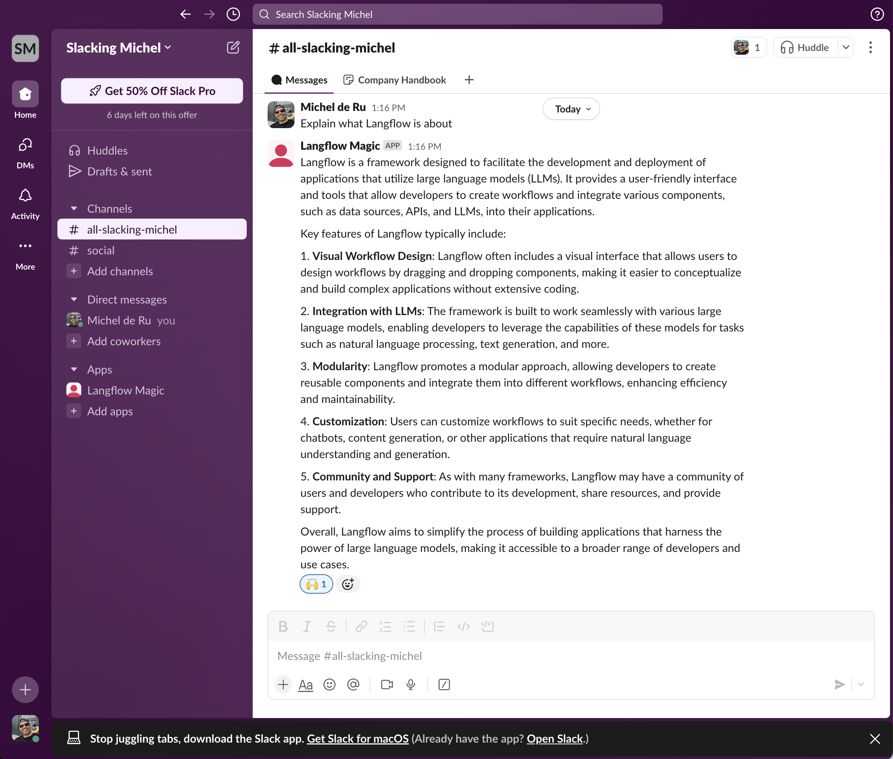

# Enhancing Slack Workflows with Langflow Agents

In today’s dynamic workplace, efficiency and intelligent automation are paramount. [Langflow](https://github.com/langflow/langflow) brings the power of advanced language models and **AI agents** directly into your **Slack workflows**, enabling seamless automation, intelligent responses, and real-time assistance without ever leaving your chat window.

> Embrace the power of Langflow in your Slack workflow to achieve seamless automation, smarter collaboration, and unparalleled efficiency.

With Langflow, you can design and deploy sophisticated agents capable of handling a wide range of tasks – from answering complex queries and summarizing lengthy discussions to managing project workflows and retrieving critical data from integrated tools. The flexibility of Langflow allows you to build custom agents tailored to your team’s unique needs, ensuring that every interaction is smart, efficient, and context-aware.



Integrating **Langflow with Slack** through a dedicated app unlocks a new level of productivity. The app acts as a bridge, allowing Slack users to call Langflow agents directly within their channels. Whether you need a quick report, an automated follow-up, or AI-driven insights, Langflow agents are just a command away. This integration not only saves time but also enhances collaboration by providing instant access to AI-powered assistance where teams already communicate.

## Features

- Receive messages from Slack
- Process messages using Langflow flows
- Send responses back to Slack channels
- Easy setup and configuration

## Prerequisites

- Python 3.8+
- A Slack workspace with admin access
- Langflow instance running
- Slack Bot Token
- Slack App Token

## Setup

1. Create a Slack App
   - Go to [Slack API Apps](https://api.slack.com/apps)
   - Click "Create New App" and choose "From scratch"
   - Select your workspace
   - Enable Socket Mode in "Socket Mode" section
   - In "OAuth & Permissions":
     - Add bot token scopes: 
       - `chat:write` (to send messages)
       - `channels:history` (to read channel messages)
     - Install the app to your workspace
     - Copy the "Bot User OAuth Token" (starts with `xoxb-`)
   - In "Basic Information":
     - Scroll to "App-Level Tokens"
     - Generate a token with `connections:write` scope
     - Copy the token (starts with `xapp-`)
   - In "Event Subscriptions":
     - Toggle "Enable Events" to On
     - Subscribe to bot events:
       - `message.im` (listens for messages in your app's DMs with users)
       - `message.channels` (listens for messages in public channels that your app is added to)
       - `message.groups` (listens for messages in public channels that your app is added to)
       - `message.mpim` (listens for messages in multi-person DMs that your app is added to)
     - Click "Save Changes"

2. Install dependencies
   ```bash
   pip install -r requirements.txt
   ```

3. Configure environment variables
   - Copy `.env.example` to `.env`
   - Add your Slack tokens:
     - `SLACK_BOT_TOKEN`: The Bot User OAuth Token (starts with `xoxb-`)
     - `SLACK_APP_TOKEN`: The App-Level Token (starts with `xapp-`)
     - `LANGFLOW_API_URL`: Your Langflow Flow URL

## Usage

1. Start the Slack bot:
   ```bash
   python slack_bot.py
   ```

2. Create or reuse a Langflow flow

   You can also use a simple flow from this repository: [Langflow Slack Integration Test](https://github.com/langchain-ai/langflow/blob/main/langflow-slack/Slack-Integration-Test.json)

2. Invite the bot to your desired Slack channel

3. Test the bot by sending a message to it:
   ```
   Hello!
   ```

4. Now call your Langflow flow by asking a question:
   ```
   What is Langflow all about?
   ```